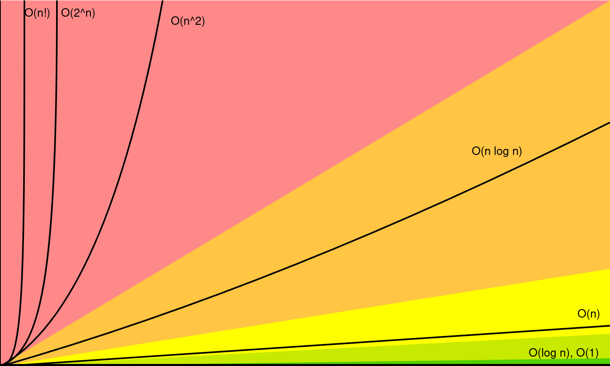

<h1>Data Structures & Algorithms</h1>

<h2>Big O</h2>
<ul>
    <li>Time Complexity: Measured in number of operations</li>
    <li>Space Complexity: How much space the operation takes</li>
</ul>

<h3 style="text-decoration: underline;">Big O is always the worst case</h3>

    
<ul>
    <li>O(n^2) = Loop within a loop</li>
    <li>O(n) = proportional</li>
    <li>O(log n) = Divide and conquer</li>
    <li>O(1) = Constant, as n grows the number of operations remains constant</li>
</ul>

<h4>Extra</h4>
<ul>
    <li>Drop Constants --> O(2n) = O(n) & O(n^3) = O(n^2)</li>
    <li>Drop-non-dominants --> O(n^2 + n) = O(n^2)</li>
    <li>Different terms for inputs --> O(a+b) & O(a * b)</li>
</ul>
